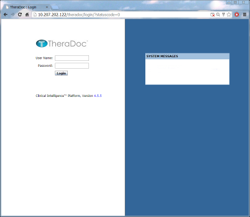
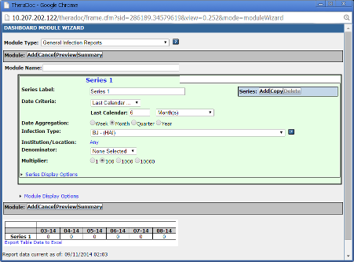
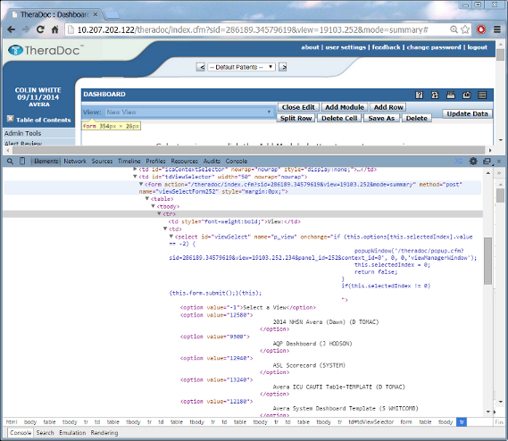

## Synopsis
This projects describes the steps necessary to [web scrape](http://en.wikipedia.org/wiki/Data_scraping) data from the [Theradoc Infection Control Application Software](http://www.theradoc.com). Specifically, we're aiming to automate the extraction, transformation and loading of TheraDoc version 4.5.5 reports and get the data into a MS SQL Server database. The end goal is to use and illustrate this data in other SSRS reports. 

The TheraDoc Dashboard Builder is inflexible and lacking in usability. Extracting data from TheraDoc requires a human to login, navigate, view then manually export an Excel file. There is no API to call. The following is a detailed description how to automate this with the R programming language.



## Setting up TheraDoc reports

To create a new Dashboard View, login and select Dashboard >> New View >> Add Module >> Select Module Type (e.g. General Infection Report). This will launch the Dashboard Module Wizard which is pretty straight forward to use. Refer to the built in help docs to build and save your dashboard view.



## Identify Dashboards in the DOM

By viewing the page source (in Chrome Ctrl+Shift+I) you can isolate and indentify your reports in the drop down list. Burried in the nest of tables you will find the form POST action with the name **viewSelectForm252**. Within this you'll find a table containing your reports and their id numbers. These are identify with html tags like <option value="1234">. At the end of this form action table you'll see the action name **changeView**. These three data points are what you need to compose an http POST to obtain your report.



##  Logging in

Logging into the TheraDoc application requires a URI, username and password. You'll notice that the session id (sid) is also appaneded to almost every action. This may appy to cookies too. Thankfully the {httr} package manages these for us.

#### Define a login and menu select function

This function will 

1. login to TheraDoc with the credentials you supply

2. select you report by the report id you supply

3. parse the HTML (or traverse the DOM if your come from a JavaScript world)

4. Reorder some of the rows to align with the data with the labels

5. return a matrix object of characters

```{r}
getData <- function (view, measure) {
        # Load RCurl helper package
        library(httr)
        # Load the XML/HTML XPath parsing package
        library(XML)
        # Override MS Windows Registry Proxy Settings
        Sys.unsetenv("http_proxy")
        # Identify the target FQDN
        url  <- "http://ahdc372n2.phs-sfalls.amck.net"
        # Assign results of HTTP POST operation to Authenticate
        login <- POST(url, body=list(username="clinintell", password="01dEnglish"), 
                      path="theradoc/login/index.cfm" )
        # Make a selection from a dropdown list with an HTTP POST
        results <- POST(url, body=list(name="viewSelectForm252", changeView=view),
                        path="theradoc/index.cfm?view=20616.252" )
        # Parse the returned HTML results (DOM
        code <- htmlParse(results, asText=TRUE, trim=TRUE)
        # Use XML XPath to parse DOM and include/exclude nodes
        plain.text <- xpathSApply(code, "//text()[ancestor::table]
                                [ancestor::div[@id='dashboardContent']]
                                [not(ancestor::script)] [not(ancestor::style)]", xmlValue)
        # Cleanse plain.text with Regex Foo
        data <- gsub("[\r\n\t[:blank:]?]", '', plain.text)
        # Assign our clean data to a matrix object
        x <- matrix(nrow=6, ncol=2, byrow=TRUE,
                    c( data[c(25,35)], data[c(37,47)], data[c(49,59)],
                       data[c(61,71)], data[c(73,83)], data[c(85,95)] ) 
        )        
        colnames(x) <- c("Facility", "results")        
        measure <- rep(measure, 6) # Add a measure ID column
        x <- cbind(x, measure)
        # Return the data object x
        return(x)
}
```
You call the function by passing in two parameters - your report id number and the measure name as a character string.
```{r}
getData(13640,"cauti")
```

### Extracting Numerators & Denominators
Once data is returned, regular expression matching is used to pick apart the wierd format. There is no means to do this reformatting in the TheraDoc 4.5.5 Dashboard builder.
```{r}
getNumerator <- function (x) {
        substr(x, 
               (regexpr("\\[", x)[1])+1, # Match to first square bracket []
               (regexpr("\\/", x)[1])-1  # Match to the first slash /
        )
}
getDenominator <- function (x) {
        substr(x,
               (regexpr("\\/", x)[1])+1, # Match to the first slash /
               (regexpr("\\*", x)[1])-1  # Match to the first star * 
        )
}
```

### Combining and Date Stamping
```{r}
numDen <- function(x) {
        Num <- lapply(x[,2], getNumerator)
        x <- cbind(x, Num) # Add Num column back to matrix
        Den <- lapply(x[,2], getDenominator)
        x <- cbind(x, Den) # Add Den column back to matrix
        rowupdatetime <- rep(format(Sys.time(), "%a %b %d %X %Y"), 6)
        x <- cbind(x, rowupdatetime) # Add a row date time stamp        
        return(x) # Return the combined matrix
}
```
We now have complete and clean data extracted from the TheraDoc report and held in a matrix.
```{r}
numDen(getData(13640, "cauti"))
```

### Clean and Load the data in SQL Server
```{r}
# Set a working directory
setwd("C:\\Users\\cwhite2\\Documents\\Theradoc")
# Load all my helper functions
source("getData.R")
# Get and clean the reports
cauti <- numDen(getData(13640, "cauti")) 
clasbi <- numDen(getData(13660, "clasbi"))
ssicolon <- numDen(getData(13680, "ssicolon"))
ssihyst <- numDen(getData(13681, "ssihyst"))
# CAST and row bind into a form the RODBC can handle 
results <- as.data.frame(rbind(cauti, clasbi, ssicolon, ssihyst))
# Load ODBC library
library(RODBC)
# Create the connection string
dbhandle <- odbcDriverConnect('driver={SQL Server};
                              server=AHDC389;
                              database=ExecInsight;
                              trusted_connection=true')
# Do the SQL insert/update
sqlUpdate(dbhandle, results, table="theradoc" )
# Close the connection
close(dbhandle)
```
